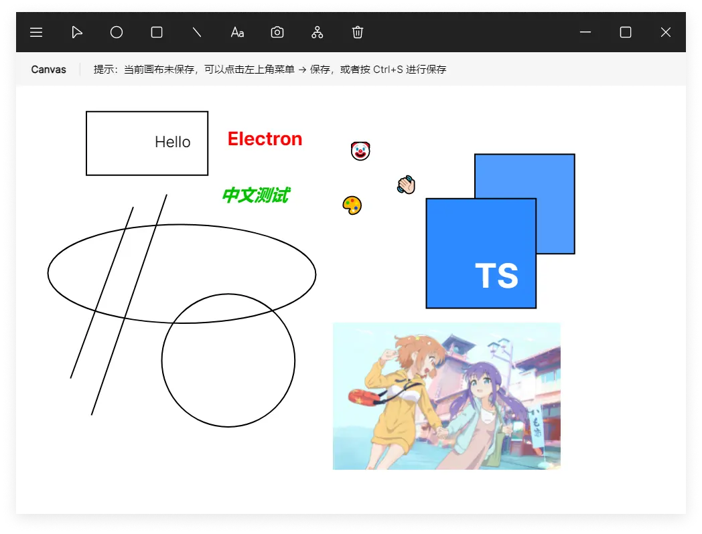

# Object-oriented Canvas


这是一个基于面向对象分析与设计的画布 App，也是软件代码开发技术的课程设计。

## 功能

- 基本的绘图功能，包括直线、圆（椭圆）、矩形（正方形）、文字、图片

- 为数不多的自定义功能，包括线的宽度和颜色、字体类型大小和颜色

- 保存和读取画板数据文件（JSON格式）

- 导出画板为 PNG、JPG 和 WebP 格式

- 可能会有 Bug 的撤销和重做功能（仅快捷键）

- 局域网共享画板功能（不是局域网应该也行）

### 不足之处

这个项目还有很多的不足之处，比如:

- 占用内存多（200MB+）

- 打开比较慢（可能因为是单文件）

- 没有画笔功能（懒得做了）

- 没有图形的移动和修改（也是懒得做了）

- 没有注释（没写过注释）

这个项目的使命（课程大作业）已经完成了，我也只是想体验一下 Electron 和 RxJS，

所以未来这个项目不一定会更新了，不过 Bug 应该还会修一修的。

## 技术

开始写这个项目的时候就计划用尽量少的依赖来做，然后用面向对象的思想开发。

- 平台方面，用的是 Electron，理论上支持 Windows、Linux 和 macOS

- 用户界面上，用 TypeScript + Lit (Web Components) 实现，UI 模仿的是 Figma

- 数据方面，用 RxJS 对事件进行绑定和处理

- 目前没有用前端的打包工具，仅使用 tsc 处理 TypeScript 文件

## 开发

推荐安装 `electronmon` 和 `concurrently` 和 `rimraf` 来运行开发环境。

```shell
# 可以安装到全局环境
yarn global add electronmon concurrently

# 启动开发环境，
# 自动监听文件改动并重启应用
yarn dev
```

注意：启动开发环境后，应用可能会报错或者自动重启一次，这是因为代码编译和运行是同时进行的，但是编译的速度比运行慢，应用在运行后可能找不到文件（还没编译完）或者运行的不是最新的代码（上一次编译的缓存），等到最新的代码编译完就可以正常运行了。

运行 `yarn build:win` 编译并打包成单文件版的 exe 文件，初次运行需要联网下载编译工具，请耐心等待。

## 开源协议

MIT License
